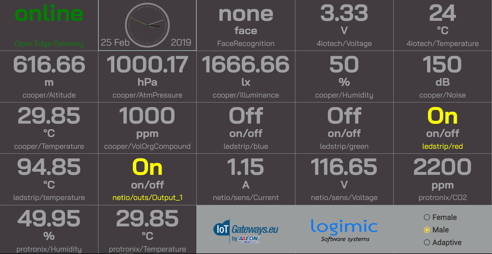

# gateway-dashboard

Nice dashboard for OpenEdgeGateway.



# A. Run via local web Server

## 1. Prerequisites

1. **npm & node.js**

    How to install it is here: https://nodejs.org/en/

2. **Local Web Server** https://www.npmjs.com/package/local-web-server

    Install:
    ```
    $ npm install -g local-web-server
    ```

## 2. Run

1. From [any release](https://github.com/logimic/gateway-dashboard/releases) download **www.zip** and unzip somewhere.
2. Run local web server in unzipped **www** or in any superior folder.
    ```
    $ ws -p 8181
    ```
    * The _8181_ number is port specification.
    * Then see command line displaying serving IP:
    ```
    Serving at http://192.168.1.228:8181
    ```
3. Open Web Browser on local or any other network computer and navigate to the serving address.

# B. Build from sources

## 1. Prerequisites

1. **npm & node.js**
How to install is here: https://nodejs.org/en/

2. **Angular cli** https://github.com/angular/angular-cli

* Latest recommended version for build is 1.4.3., install it this way:
```
npm uninstall -g @angular/cli
npm cache verify
npm install -g @angular/cli
```

## 2. Setup gateway-dashboard on your machine

1. Pull this repository
2. Open terminal/command line and go to main folder.
3. Run command

```
npm install
```

## 3. Build and Run with Angular

1.  Open terminal/command line in main folder.
2. Run server
```
ng serve
```
3. Open browser **http://localhost:4200/**

## 4. Produce build

1.  Open terminal/command line in main folder.
2. Make build
```
ng build
```
3. See **www** folder with build.
